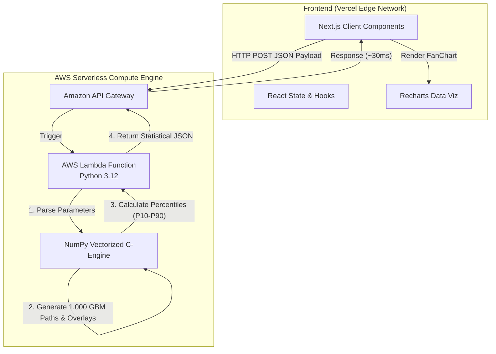

# LifeScope 動態理財與退休模擬平台 🎲

**LifeScope** 是一個結合了現代前端技術與強大雲端量化運算引擎的「人生財務沙盤推演器」。
有別於市面上傳統的固定複利計算機，本專案首創導入 **蒙地卡羅演算法 (Monte Carlo Simulation)**，能在毫秒之間跑完 1,000 次平行宇宙的股市波動與黑天鵝歷史災難壓力測試，幫助使用者看清「真實世界中破產的機率」。

> 💡 **Project Showcase / 火力展示專案**  
> 本專案為開發者於業餘時間獨立思考、設計與建置的全端系統，旨在作為 **Next.js 前端框架** 與 **AWS Serverless 雲端運算架構** 的深度實作練習。
> 本系統為 100% 免費、無營利、無商業化意圖之開源公益專案。

---

## 🚀 核心功能 (Features)

1. **基礎複利試算與人生時間軸 (Basic Projection & Life Events)**
   - 高流暢度的動態滑桿參數調整。
   - **自訂重大事件**：獨家實作人生重大事件時間軸模組，可讓使用者自由加入單年度的意外收支（例如買車、結婚、生子或收到遺產），並在圖表上以動態標記 (Reference Dots) 與自訂 Tooltip 視覺化呈現。
   - 採用 Recharts 實作極具現代感的資產增長 Area Chart。
2. **🎯 退休目標倒推規劃 (FIRE Goal Planner)**
   - **逆向推演算法**：輸入理想的資產目標與年限，系統會自動反推達成計畫所需的「每月最低應投資金額」以及「需要達成的年化報酬率」，協助逆向規劃財務目標。
3. **⚖️ 財務槓桿策略與信貸模擬 (Financial Leverage)**
   - 支援模擬取得低利率信貸進行投資套利的策略。
   - 系統會自動從「月投資額」中扣除本息還款，並支援「定期循環續借」的真實財務運作邏輯。
4. **🧬 人生路徑發展與經濟規模開支 (Life Path Stages)**
   - 劃分「年輕養成期」、「家庭壯年期」與「退休空巢期」三大人生階段。
   - 引進經濟學的**家庭規模開支遞減模型 (Family Multipliers)**，自動根據各階段家庭成員人數動態調整開支乘數，提供更貼近真實家庭生涯的現金流估算。
5. **💼 理專進階實務建議設定 (Professional Advisory)**
   - **摩擦損耗模型**：可設定 0.1% ~ 3% 的交易手續費、ETF 內扣費用及稅務摩擦，模擬真實投資組合的獲利折損。
   - **保險防禦機制 (Insurance Overlay)**：每月支付固定保費規避「人生中斷型財務黑天鵝事件」，大幅提升整體策略的穩健度。
6. **🏠 買房 vs 租屋決策引擎 (Housing vs Renting)**
   - 房貸本息攤還精密計算，支援自訂房貸寬限期。
   - 交叉對比「租屋全數投資」與「買房繳房貸並持有房產」在不同比較年期下（支援 5 ~ 50 年）的淨資產黃金交叉點。
7. **🎲 蒙地卡羅壓力測試 (Monte Carlo Stress Test)**
   - **雲端高效運算**：後端搭載 Python `NumPy` 向量運算，單次點擊即時結算 1,000 種未來經濟環境隨機路徑。
   - **Fan Chart (扇形信心區間圖)**：視覺化呈現 P10 到 P90 的財富區間。
   - **歷史災難與隨機崩盤 (Scenario Overlay & Jump Diffusion)**：獨家支援內建百年間的真實災難劇本（1929 經濟大蕭條、達康泡沫、2008 金融海嘯）與隨機跳躍擴散崩盤模型，可由使用者自由拖拉「劇本爆發時機」，徹底測試退休現金流的生存機率。

---

## 🛠️ 技術棧 (Tech Stack)

### Frontend (User Interface)
* **Framework**: React 19 + Next.js 16 (App Router)
* **Styling**: Tailwind CSS + 原生 CSS Variables (Design Tokens)
* **Visualization**: Recharts 
* **State Management**: React Hooks (useState, useMemo, useCallback) + Client-side LocalStorage Persistence
* **Hosting**: Vercel

### Backend (Quantitative Compute Engine)
* **Architecture**: Serverless Microservice
* **Cloud Provider**: Amazon Web Services (AWS)
* **Core Engine**: AWS Lambda (Python 3.12)
* **API Gateway**: AWS API Gateway (REST HTTP API)
* **Data Science**: `numpy` v2 (Matrix vectorization for extreme low-latency computations)

---

## 🏗️ 系統架構圖 (System Architecture)

---

## 🧑‍💻 開發者聲明 & 聯絡方式

本工具由開發者於下班時間基於技術熱忱獨立建置。

**合規宣告**：
* 本站不向使用者收取使用費用，所有試算功能完整開放、無付費牆、無訂閱方案。
* 站內可能出現第三方合作連結（例如券商開戶推薦）或自願性支持管道；若您透過合作連結完成註冊，本站可能獲得推薦回饋。此類合作**不影響試算引擎的邏輯與結果**，亦不構成任何金融商品之推薦。
* 網站本身僅為觀念驗證 (PoC) 與全端工程之技術展示名片。

如果您對本系統的雲端架構設計、前端渲染優化有任何指教，或發現了系統 Bug，非常歡迎透過 [GitHub Issue](https://github.com/sjjcoder/lifescope/issues) 與我交流。

> **免責聲明**：本工具僅提供客觀數據運算與情境模擬，不代表未來實際投資績效。本站不提供任何特定金融商品之買賣建議，亦不構成投資顧問服務。投資有風險，使用者應自行判斷並承擔所有投資決策之結果。

